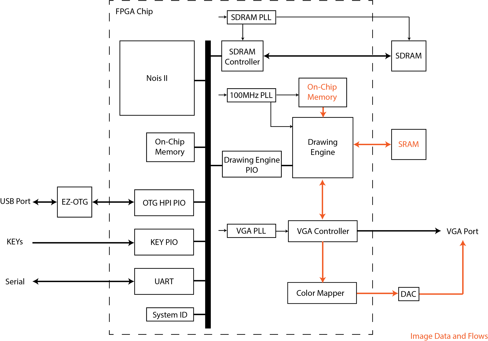
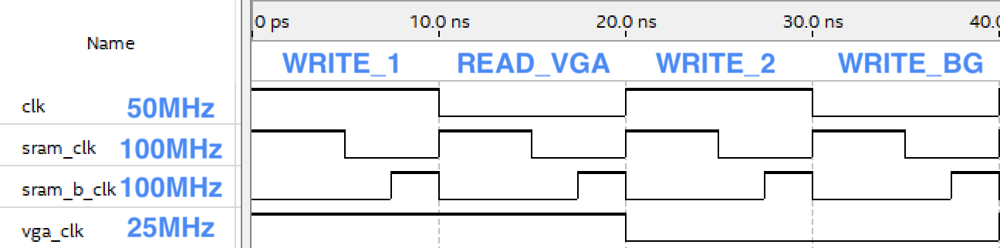
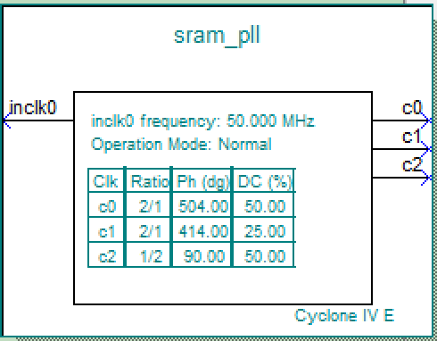

# FPGA-Boxhead

[Boxhead](https://www.crazymonkeygames.com/series/Boxhead-Series.php) video game on DE2-115 FPGA as UIUC ECE385 Digital Systems Lab Spring 2020 ZJUI section final project .

## Features

* Framebuffer-based hardware graphic engine
  * 640x480 60Hz VGA output
  * 16-bit color depth
  * Double buffering
  * 60Hz game refresh rate + auto background refresh using 100MHz SRAM with customized PLLs
  * DMA sprite copy engine IP module
* EZ-OTG USB keyboard input
* Software game logic system on Nois II SoC
  * Dual players (Similar to Boxhead 3)
  * Badic type of zombies with automatic movement and attack
  * Support the most basic weapon: pistol
  * Movement animations

## Authors

* Zikai Liu (zikail2@illinois.edu)
* Qi Gao (qig2@illinois.edu)

## Block Diagram

## About 100MHz SRAM Controller

VGA standard requires us to output pixels at the rate of approximately 25MHz. However, the main clock of the FPGA is only 50MHz. Since we are using SRAM as the buffer holder, which doesn’t support concurrent R/W, we only have two read and/or write operations for each pixel, on average, during one frame. Excluding one necessary read operation to generate VGA output, the remaining one write operation is clearly insufficient, as we must overwrite the whole background before drawing any sprite (since we use the framebuffer approach). One possible solution is to reduce the actual game refresh rate, for example, to 30Hz, a half of VGA refresh rate, by switching game frame every two VGA frames. However, this approach only provides one more write cycles for each pixel, as read operations still take half of the time (we must output VGA color at 25MHz). On the other hand, since we are implementing an shooting game, reducing refresh rate is likely to diminish the user experience.

Our solution to this problem is to promote the SRAM to 100MHz and implement a 4-cycle state machine in the SRAM controller. We generate two 100MHz clock signals sram_clk and sram_b_clk using 50MHz input clock using PLL IP. The overall clocks signals are shown in the following figure.

The sram_clk is 4 times as fast as the vga_clk, which splits time for one pixel into 4 stages:
* WRITE_1: in this stage, one input 16-bit value given by the copy engine is written into SRAM.
* READ_VGA: in this stage, one 16-bit value is read from SRAM to output to VGA.
* WRITE_2: in this stage, another input 16-bit value given by the copy engine is written into SRAM.
* WRITE_BG: in this stage, one 16-bit value is written to the location just read as VGA output, which serves as the background for next frame.

We are using double buffering. Denote two frame buffers as index 0 and 1. For example, if current displaying frame is frame 0, READ_VGA reads from frame 0; WRITE_1 and WRITE_2 write to frame 1, the hidden frame; WRITE_BG writes to the same address as READ_VGA on frame 0, which clear the pixel we have just read. This means that when we switch to next frame 1, frame 0 will be totally clean with the background color. As the consequence, we don’t need to clear the background manually so that WRITE_1 and WRITE_2 can be used purely for sprite drawing. In total, we get 3 times more writing throughput (one is used for the background) compared to the original 50MHz SRAM. In addition, WRITE_1 and WRITE_2 are aligned with the main clock, which means the copy engine can write one pixel per cycle seamlessly without any synchronization.

One challenging we faced is that this approach consists of three consecutive write cycles. SRAM works in asynchronized way, which requires explicit pulling down on SRAM_WE_N to initiate a write cycle. If we keep SRAM_WE_N low for all three cycles, only the first one will take effect. On the other hand, during the write operation, SRAM_WE_N must stay low for a certain amount of time until the write is completed. Early high in SRAM_WE_N will terminate the operation. To solve this problem, we introduce a new clock signal, sram_b_clk, with 100MHz, 25% duty cycle and -2.5ns offset. It is used to drive SRAM_WE_N during write cycles, and its high part informs SRAM to initiate the next write cycle, while its 80% low part is sufficient for SRAM to complete the write operation. It is ahead of sram_clk and address to read/write is launched at its rising edge, which allows address to get ready before WE/OE signals arrive at the SRAM.

Additional offsets are also added to compensate data delay. The final PLL configuration is shown as the following figure.

The 100MHz SRAM controller serves as the basic of our high-efficient graphic engine and allows 60Hz game refresh rate. 

However, it’s worth noting that introducing such high frequency imposes very high constraints on our data path delays. The data delay must be very short, or they won’t catch up with the read/write cycles. During our implementation, we were already closed to the limit. As we are using on-chip memory to store our resources, even changing the resources can lead to image failure (maybe due to longer data delay caused by data placement in different memory blocks).

## Acknowledges
The image resources come from the [Boxhead](https://www.crazymonkeygames.com/series/Boxhead-Series.php) game.